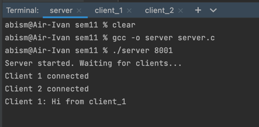
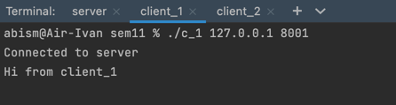
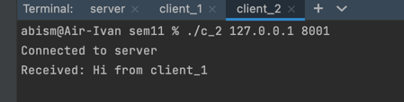

# ОСИ Домашняя работа 11
## Киселев Иван БПИ217.

### Решение задания на C находится в файлах server.c  (server) и  client_1.c, client_2.c  (c_1, c_2)

> Сервер перенаправляет сообщения от клиента_1 клиенту_2 используя протокол TCP

