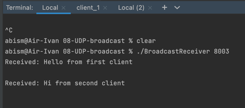
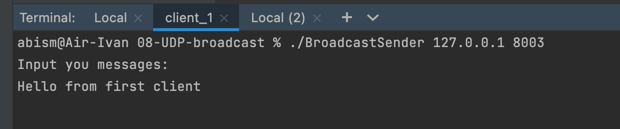
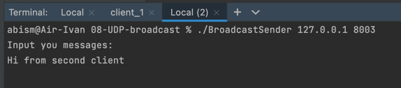

# ОСИ Домашняя работа 12
## Киселев Иван БПИ217.

### Решение задания на C находится в файлах BroadcastReceiver.c (BroadcastReceiver) и  BroadcastSender.c (BroadcastSender)

> Сервер BroadcastReceiver читает сообщения от различных клиентов BroadcastSender, так устроен broadcast используя протокол UDP

